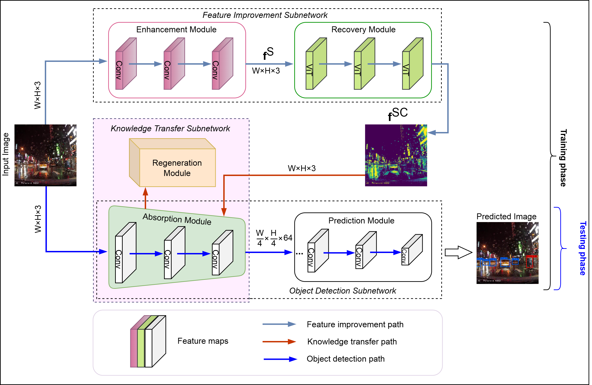

<div align="center">

DiffKA
---

### DiffKA: Diffusion-based Knowledge Absorption Approach for Robust Object Detection in Challenging Weather Conditions

<p align="center">
  <br>
  <b>DiffKA Architecture</b>
</p>

</div>

---

## Introduction

DiffKA is a novel approach for robust object detection under challenging weather conditions, including rain, haze, fog, and low-visibility scenarios. The model leverages a **diffusion-based knowledge absorption** mechanism that enables the detector to effectively learn from degraded images by transferring knowledge from clean image distributions to corrupted ones.

DiffKA addresses the fundamental challenge of domain shift caused by adverse weather — where standard detectors trained on clean data suffer significant performance drops when deployed in real-world rainy or hazy conditions. By integrating a diffusion-guided denoising prior into the detection pipeline, DiffKA achieves robust feature extraction and maintains high detection accuracy across varying weather severities.

---

## Datasets

### RNT Dataset

- **Paper:** [RNT: Real-World Nighttime and Adverse Weather Benchmark](https://ieeexplore.ieee.org/abstract/document/10541873)
- A challenging benchmark containing real-world images captured under nighttime and adverse weather conditions, designed to evaluate object detection robustness.

### RID Dataset

- **Paper:** [Single Image Deraining: A Comprehensive Benchmark Analysis (CVPR 2019)](https://openaccess.thecvf.com/content_CVPR_2019/html/Li_Single_Image_Deraining_A_Comprehensive_Benchmark_Analysis_CVPR_2019_paper.html)
- A comprehensive deraining benchmark providing paired rainy/clean image sets for training and evaluating image restoration and detection methods under rain degradation.

---

## Trained Weights

Pre-trained model weights for DiffKA are available below:

| Model | Dataset | Download |
|-------|---------|----------|
| DiffKA_model | RNT + RID | [Download](https://github.com/val-utehy/DiffKA) |

Place the downloaded weights at the root of the repository:

```
DiffKA_model.pt
```

---

## Inference

```python
from ultralytics import YOLO

weights_path = "DiffKA_model.pt"

model = YOLO(weights_path)

results = model.predict(
    source="path/to/image_or_folder",
    imgsz=640,
    conf=0.25,
    iou=0.6,
    save=True
)

print("Inference completed.")
```

---

## Acknowledgement

The codebase is built upon [Ultralytics](https://github.com/ultralytics/ultralytics) and [YOLOv12](https://github.com/sunsmarterjie/yolov12).  
We sincerely thank the authors of the RNT and RID datasets for making their benchmarks publicly available, and the broader object detection community for their foundational contributions.